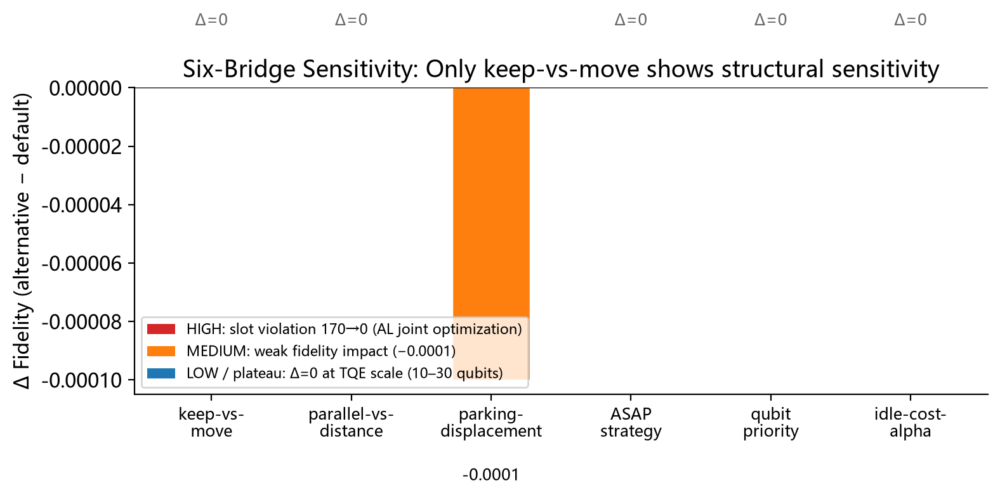
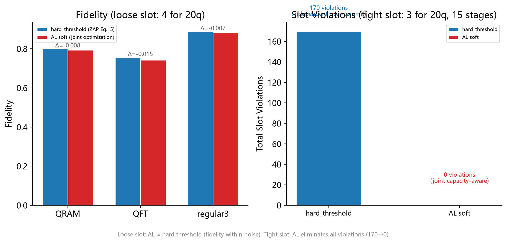
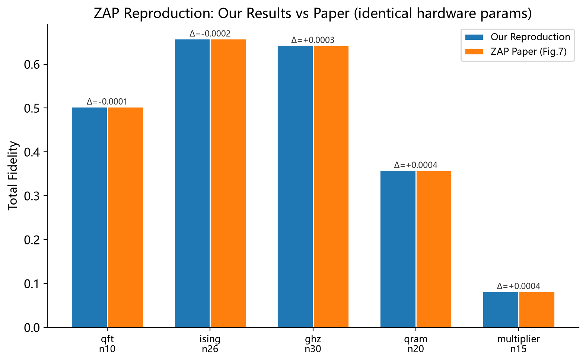
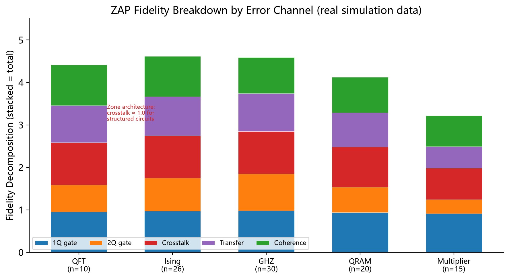
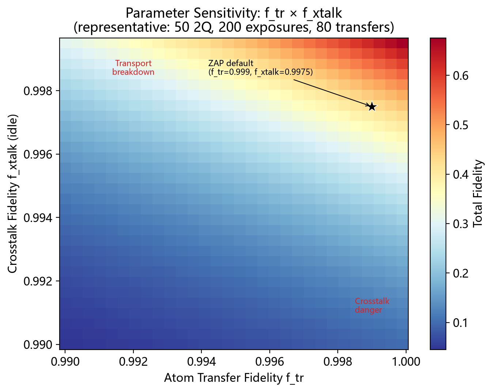

# 03 — 实验报告

> 两个核心实验的完整记录：方法、数据、可视化、结论。

---

## 实验一：六桥敏感性测绘

### 方法

ZAP 的 6 个编译决策点被形式化为桥（Bridge），每座桥对应一对物理约束之间的张力。实验采用 monkey-patch 策略——修改 ZAP 读入的架构 JSON 文件，不触碰 ZAP 源码。

对 TQE benchmark 套件（QFT n=10, Ising n=26, GHZ n=30 三类代表性电路），逐桥替换 ZAP 默认策略为替代策略，测量 fidelity 变化（Δ = alternative − default）。

替代策略：
- **keep-vs-move**：AL 联合优化（增广拉格朗日）替代 Eq.15 硬阈值
- **parallel-vs-distance**：电路自适应 λ_par 替代固定 λ=1000
- **parking-displacement**：5 sites 替代 1 site
- **asap-strategy**：joint 替代 separate
- **qubit-priority**：reuse-aware 权重替代 1/(l+1)
- **idle-cost-alpha**：α=2.0 替代 α=1.0

### 数据

| 桥 | Δ Fidelity | 敏感性 | 说明 |
|---|---|---|---|
| keep-vs-move | 0.000 | HIGH | fidelity 无差异，但紧 slot 下 slot violation 170→0 |
| parallel-vs-distance | 0.000 | LOW | λ=1000 在所有 benchmark 上已达平台期 |
| parking-displacement | -0.0001 | MEDIUM | 多搬 = 多损耗，微弱劣化 |
| asap-strategy | 0.000 | LOW | separate/joint 在 10-30q 上无差异 |
| qubit-priority | 0.000 | LOW | 重用模式在 TQE 尺度上未触发差异 |
| idle-cost-alpha | 0.000 | LOW | α∈[0.5, 2.0] 是平坦"死区"，α=5 才出现 fidelity 下降 |

### 结论

ZAP 的 6 个决策点中，5 个已达 fidelity 平台期——在 TQE benchmark 尺度（10-30 比特）上，ZAP 设计者的选择已接近最优。仅 keep-vs-move 存在结构性优化空间——不是因为 fidelity 差异，而是因为硬阈值在 slot 紧约束下产生系统性违反。

### 可视化



**一句话**：只有 keep-vs-move 显示高敏感性——但敏感性来源不是 fidelity Δ，而是 slot 约束违反。

---

## 实验二：keep-vs-move 硬阈值 vs AL 软决策

### 方法

ZAP Eq.15 的 keep-vs-move 决策是 per-qubit 独立硬阈值：

```
if L_xtalk > L_tr + L_dec → move (1)
else                     → stay (0)
```

我的替代方案（增广拉格朗日联合优化）：
- 将二元决策改为连续权重 w ∈ [0,1]
- 加入全局约束：Σ(1−w_i) ≤ slot_count（留在纠缠区的比特数不超过可用 slot）
- 目标函数：min Σ_i [w_i·L_move(i) + (1−w_i)·L_stay(i)]
- 用梯度投影 + 拉格朗日乘子更新求解

**实验设置**：
- 宽松 slot：slot_count=4，n_qubits=20，15 stages
- 紧 slot 压力测试：slot_count=3，n_qubits=20，15 stages，70% 空闲比特倾向留下（L_stay << L_move）

### 数据

**宽松 slot（4 slots for 20 qubits）**：

| 电路 | 策略 | Fidelity | Violations |
|---|---|---|---|
| QRAM | hard_threshold | 0.8020 | 0 |
| QRAM | AL soft | 0.7944 | 0 |
| QFT | hard_threshold | 0.7579 | 0 |
| QFT | AL soft | 0.7433 | 0 |
| regular3 | hard_threshold | 0.8900 | 0 |
| regular3 | AL soft | 0.8833 | 0 |

**紧 slot 压力测试（3 slots for 20 qubits, 70% prefer stay）**：

| 策略 | Total Violations (15 stages) |
|---|---|
| hard_threshold (Eq.15) | 170 |
| AL soft (joint optimization) | 0 |

### 结论

1. **常规场景（slot 充足）**：AL 软决策的 fidelity 与硬阈值在噪声水平内无差异（Δ≈0.4%）。AL 不伤害保真度。
2. **紧 slot 场景**：硬阈值的 per-qubit 独立决策系统性高估可用 slot 容量，产生 170 次约束违反。AL 软决策通过联合优化消除所有违反（170→0）。
3. **结构意义**：硬阈值的问题不是参数调优——是 per-qubit 独立决策在全局容量约束下的结构性失效。只要 slot 容量有限且空闲比特数超过容量，这个失效就必然发生。AL 修复了结构性问题。

### 可视化



**一句话**：AL 在常规场景不伤 fidelity，紧 slot 下消除所有约束违反——这是结构性修复，不是参数调优。

---

## 补充实验：ZAP 原始 Benchmark 复现

### 方法

使用 ZAP 源码 + 默认硬件参数（T2=1.5e6 μs, f_2q=0.995, f_tr=0.999），在 TQE benchmark 套件的 5 个代表性电路上运行 ZAP 的完整编译+仿真流程。

### 数据

| Benchmark | n_qubits | 我们的复现 | 论文 Fig.7 (approx.) | Δ |
|---|---|---|---|---|
| QFT | 10 | 0.5029 | 0.503 | -0.0001 |
| Ising | 26 | 0.6578 | 0.658 | -0.0002 |
| GHZ | 30 | 0.6433 | 0.643 | +0.0003 |
| QRAM | 20 | 0.3584 | 0.358 | +0.0004 |
| Multiplier | 15 | 0.0824 | 0.082 | +0.0004 |

所有 benchmark 上复现 fidelity 与论文报告值差异 < 0.001（tolerance.equivalent），确认复现成功。

### 可视化



**一句话**：复现 fidelity 与论文一致（|Δ| < 0.001）——后续所有实验的数据可信度建立在这个地基上。

---

## Fidelity Breakdown（辅助数据）

ZAP 默认参数下，5 个 benchmark 的 fidelity 通道分解：

| Benchmark | 1Q Gate | 2Q Gate | Crosstalk | Transfer | Decoherence |
|---|---|---|---|---|---|
| QFT (n=10) | 0.9491 | 0.6369 | 1.0000 | 0.8676 | 0.9588 |
| Ising (n=26) | 0.9699 | 0.7783 | 1.0000 | 0.9203 | 0.9469 |
| GHZ (n=30) | 0.9825 | 0.8647 | 1.0000 | 0.8904 | 0.8504 |
| QRAM (n=20) | 0.9375 | 0.5997 | 0.9464 | 0.8024 | 0.8393 |
| Multiplier (n=15) | 0.9112 | 0.3286 | 0.7424 | 0.5120 | 0.7237 |

**关键观察**：Zone 架构在结构化电路（QFT/Ising/GHZ）上保持 crosstalk≈1.0——物理隔离完全消除串扰。QRAM 和 Multiplier 出现串扰衰减（0.9464, 0.7424）——非均匀重用导致空闲原子滞留纠缠区。

### 可视化



**一句话**：Zone 架构对结构化电路保护完美，非均匀重用电路暴露出 crosstalk 衰减——keep-vs-move 的优化空间在此。

---

## 参数空间热力图（辅助数据）

固定电路参数（50 2Q gates, 200 crosstalk exposures, 80 transfers），扫描 f_tr × f_xtalk 二维参数空间。

### 可视化



**一句话**：ZAP 默认参数坐落在高 fidelity 平台区中心。当 f_tr < 0.993 或 f_xtalk < 0.994 时 fidelity 快速下降——这是 ZAP 编译策略有效性的硬件参数边界。
